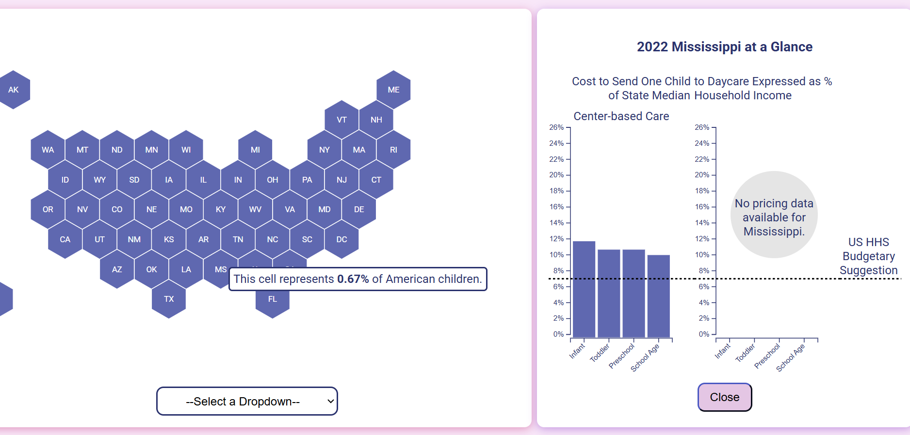

# Examining US Childcare Affordability

Callie Leone

## Description

Since the COVID-19 pandemic, childcare affordability has been a particularly hot
topic nationwide. While many of us share the understanding that childcare is
"expensive", visualization helps to add vital texture and contextualize the extent 
to which quality childcare is financially out of reach for the average American family. 
Furthermore, viewers can play around with choropleth maps that symbolize rankings
for childcare regulatory restrictiveness and childcare center quality to 
investigate the complex and at times tenous relationship between regulation, quality,
and affordability.

## Data Sources

- US Department of Labor, Women's Bureau, National Database of Childcare Prices
    - National Database of Childcare Prices: State-Level Estimates and Affordability Rankings 2022 (https://www.dol.gov/sites/dolgov/files/WB/NDCP2022-state-level-estimates-and-rankings.xlsx)
- 2022 ACS Census Data (https://www.census.gov/library/publications/2023/demo/p60-279.html)
- WVU Childcare Regulation Index in the States: 1st Edition (https://csorwvu.com/childcare_regulation_index_1/)
- Childcare Aware of America (https://info.childcareaware.org/hubfs/wecandobetter_20rankings2020041013(1).pdf)
- Did not directly use, but heavily referenced this Chicago Fed report
    - (https://www.chicagofed.org/publications/chicago-fed-insights/2024/childcare-access-affordability-seventh-district)