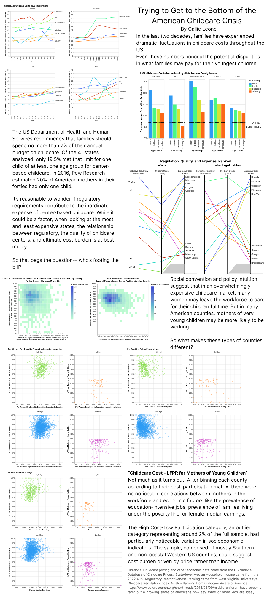

# Childcare Affordability & Female Labor Force Participation

Callie Leone

## Description

For a long time now there has been wide public consensus that access to safe,
convenient, and affordable childcare has been out of reach for many American
families. When external childcare becomes untenable, often women are under
pressure and cultural expectations to give up their jobs, either taking on
low paid part time work or forgoing the workforce altogether. I wanted to explore
in more texture what makes childcare so unaffordable and how widespread of an
issue it is throughout the states. As it turns out, while there are of course
commonalities (care for infants is expensive!), there are a lot of diverging
factors that may be affecting affordability in different parts of the country.

To the point about female labor force participation, early on I made the unusual
finding that in many counties, mothers of very young children are *more* likely
to be in the workforce than the average woman aged 20-64. I was not able to get
a great sense for why that is, but I hope to keep exploring in my next project.

{REQUIRED: an embedded screenshot of your final project}

## Data Sources

- US Department of Labor, Women's Bureau, National Database of Childcare Prices
    - National Database of Childcare Prices: 2008-2022 (https://www.dol.gov/sites/dolgov/files/WB/NDCP2022.xlsx)
    - National Database of Childcare Prices: State-Level Estimates and Affordability Rankings 2022 (https://www.dol.gov/sites/dolgov/files/WB/NDCP2022-state-level-estimates-and-rankings.xlsx)
- 2022 ACS Census Data (https://www.census.gov/library/publications/2023/demo/p60-279.html)
- WVU Childcare Regulation Index in the States: 1st Edition (https://csorwvu.com/childcare_regulation_index_1/)
- Childcare Aware of America (https://info.childcareaware.org/hubfs/wecandobetter_20rankings2020041013(1).pdf)
- Pew Research, American Family Sizes (https://www.pewresearch.org/short-reads/2018/08/09/middle-children-have-become-rarer-but-a-growing-share-of-americans-now-say-three-or-more-kids-are-ideal/)
- Did not directly use, but heavily referenced this Chicago Fed report
    - (https://www.chicagofed.org/publications/chicago-fed-insights/2024/childcare-access-affordability-seventh-district)

Reminder: Your final PDF/HTML also **must** contain citations for your data.